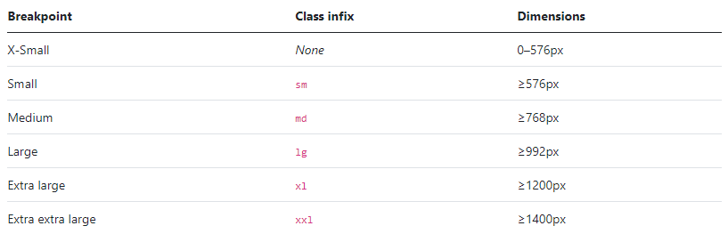

# Les bases de Bootstrap

SaLut Wonderland!!
Je me suis pris la tête à mettre en forme ce petit fichier sur .md pour que tu puisses t'en servir... N'hésites pas à en abuser!!

Ceci dit il n'est pas encore terminé!! la suite arrive bientot..

### Ajouter des couleurs

```html
<html>
    <p class="text-primary">.text-primary</p>
    <p class="text-secondary">.text-secondary</p>
    <p class="text-success">.text-success</p>
    <p class="text-danger">.text-danger</p>
    <p class="text-warning bg-dark">.text-warning</p>
    <p class="text-info bg-dark">.text-info</p>
    <p class="text-light bg-dark">.text-light</p>
    <p class="text-dark">.text-dark</p>
    <p class="text-body">.text-body</p>
    <p class="text-muted">.text-muted</p>
    <p class="text-white">.text-white</p>
</html>
```

### Ajouter une couleur de background

```html
<html>
    <div class="bg-primary">.bg-primary</div>
    <div class="bg-secondary">.bg-secondary</div>
    <div class="bg-success">.bg-success</div>
    <div class="bg-danger">.bg-danger</div>
    <div class="bg-warning">.bg-warning</div>
    <div class="bg-info">.bg-info</div>
    <div class="bg-light">.bg-light</div>
    <div class="bg-dark">.bg-dark</div>
    <div class="bg-white">.bg-white</div>
    <div class="bg-transparent">.bg-transparent</div>
</html>
```

### Gérer les dimensions

```html
<html>
    <div class="w-25"></div>
    <div class="w-50"></div>
    <div class="w-75"></div>
    <div class="w-100"></div>
    
    <!-- Pareil avec height -->
    
    <div class="h-..."></div>
    
    <div class="vh-100"></div>
    <div class="vw-100"></div>
    
    <div class="min-vh-100"></div>
    <div class="min-vw-100"></div>
</html>
```

## Notions intermédiaires

### Les "breakpoints"



### Aligner du texte

```html
<html>
<div class="text-start"></div>
<div class="text-center"></div>
<div class="text-end"></div>
 
<div class="text-md-center text-sm-end text-center"></div>
</html>
```

### Transformer du texte

```html
<html>
<p class="text-lowercase">tout est en minuscule.</p>
<p class="text-uppercase">TOUT EST EN MAJUSCULE.</p>
<p class="text-capitalize">Tout Nouveau Mot Commence Par Une Majuscule.</p>
</html>
```

### Gérer le text-decoration

```html
<html>
<a class="text-decoration-line-through">Texte barré</a>
<a class="text-decoration-underline">Texte souligné</a>
<a class="text-decoration-none">Texte sans surlignement</a>
</html>
```

### Mettre en forme

```html
<html>
<p class="fw-bold">Texte en gras.</p>
<p class="fw-bolder">Texte très gras.</p>
<p class="fw-normal">Texte sans gras.</p>
<p class="fw-light">Texte léger.</p>
<p class="fw-lighter">Texte très léger.</p>
<p class="fst-italic">Texte en italique.</p>
<p class="fst-normal">Texte sans italique.</p>
</html>
```

### Gérer les polices

```html
<html>
<p class="h1">Titre principal</p> <!-- h1, h2, h3, ... h6 -->
<h1 class="display-1">Titre principal</h1> <!-- display-1 ... display-6 --> 
<!-- Pour les descriptions --> 
<p class="lead">
    Vivamus sagittis lacus vel augue laoreet rutrum faucibus dolor auctor. Duis mollis, est non commodo luctus.
</p>
</html>
```

### Gérer les ombres

```html
<html>
<div class="shadow-none">Aucune ombre ici.</div>
<div class="shadow-sm">Petite ombre légère.</div>
<div class="shadow">Ombre par défaut</div>
<div class="shadow-lg">Ombre plutôt large</div>
</html>
```

## Les tableaux

### Initialiser un tableau

```html
<html>
<table class="table">
    ...
</table>
</html>
```

### Mettre en couleur

```html
<html>
<!-- Sur le tableau -->
<table class="table-primary">...</table>
<table class="table-secondary">...</table>
<table class="table-success">...</table>
<table class="table-danger">...</table>
<table class="table-warning">...</table>
<table class="table-info">...</table>
<table class="table-light">...</table>
<table class="table-dark">...</table>
 
<!-- Sur des lignes -->
<tr class="table-primary">...</tr>
<tr class="table-secondary">...</tr>
<tr class="table-success">...</tr>
<tr class="table-danger">...</tr>
<tr class="table-warning">...</tr>
<tr class="table-info">...</tr>
<tr class="table-light">...</tr>
<tr class="table-dark">...</tr>
 
<!-- Sur des cellules (`td` ou `th`) -->
<tr>
  <td class="table-primary">...</td>
  <td class="table-secondary">...</td>
  <td class="table-success">...</td>
  <td class="table-danger">...</td>
  <td class="table-warning">...</td>
  <td class="table-info">...</td>
  <td class="table-light">...</td>
  <td class="table-dark">...</td>
</tr>
</html>
```

### Dissocier les lignes

```html
<html>
<table class="table table-striped table-hover">
    ...
</table>
 
<!-- Et pour mettre en valeur :  -->
<tr>
    <td class="table-active">Anabelle</td>
    <td>Dupont</td>
    <td>45 ans</td>
</tr>
</html>
```

### Gérer les bordures

```html
<html>
<table class="table table-bordered border-primary">
 
</table>
 
<!-- Pour retirer les bordures -->
<table class="table table-borderless">
 
</div>
</html>
```

**Faire de petits tableaux

```html
<html>
<table class="table table-sm">
    ...
</table>
</html>
```

### Aligner verticalement les items

->Il suffit d'utiliser la classe align-middle ou align-bottom sur la ligne ou sur la cellule du tableau.

### Faire un tableau totalement responsive

```html
<html>
<table class="table table-responsive">
 
</table>
 
<!-- En utilisant les breakpoints -->
<table class="table table-responsive-lg">
 
</table>
</html>
```

### Ajouter une description

```html
<html>
<table class="table">
    <caption>Description</caption>
    ...
</table>
 
<!-- Et si on veut mettre la description au-dessus du tableau -->
<table class="table caption-top">
    <caption>Description</caption>
    ...
</table>
</html>
```
